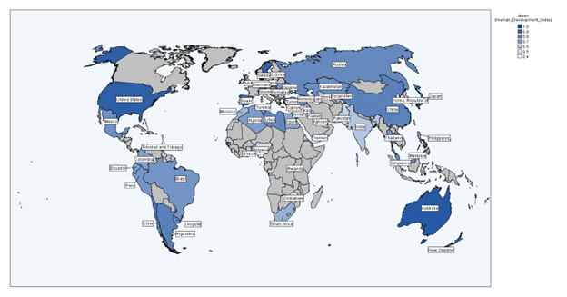
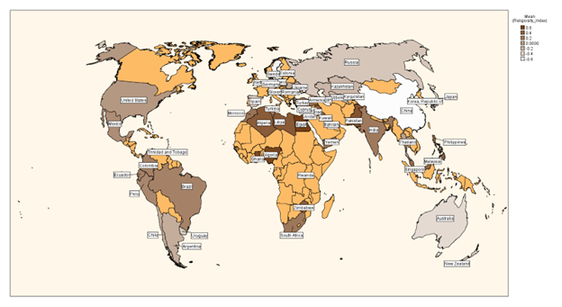
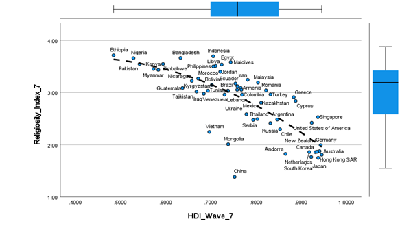

## [MA Project: Human Development and Religious Consumer Behavior](https://github.com/jamesrproffer/Portfolio-Projects)

- Downloaded and merged multiple longitudinal and cross-national datasets. See:
- [United Nation Development Programme](https://hdr.undp.org/data-center)
- [World Values Survey Wave 2-7](https://www.worldvaluessurvey.org/)
- Ran basic descriptive statistics for exploratory data analysis.
- Ultilized imputation, transformation, and general recoding techniques for data wrangling, cleaning and preparation.
- Optimized linear regression using SPSS to create a functional and accurate longitudinal and cross-national model of religious consumer behavior.
- Utilizing SPSS built-in visualizations to create maps and regression plots.

 

